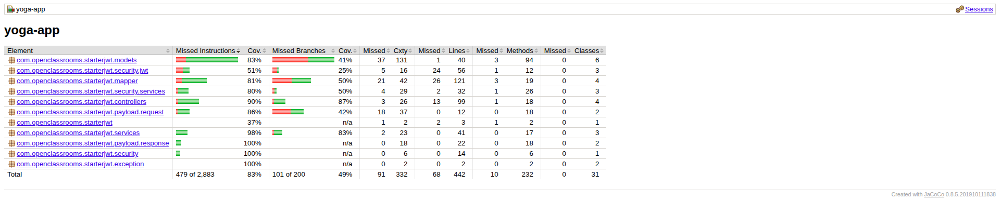
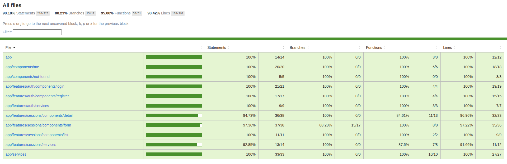
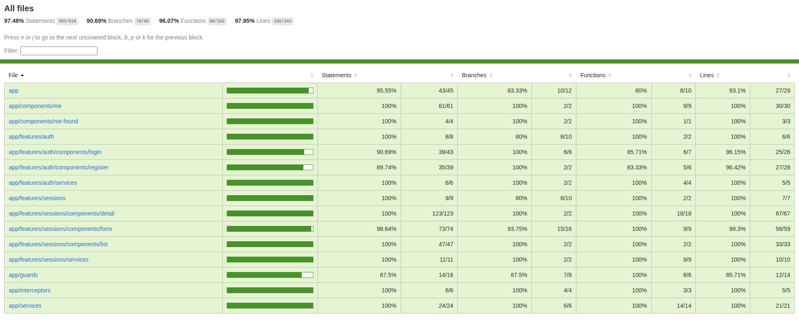

# Yoga App: Full-Stack Testing Suite

Testing suite for a full-stack Angular/Spring Boot yoga session management application. Includes front-end Jest tests, back-end JUnit/Mockito tests, Cypress E2E tests, and comprehensive coverage reports.

## Table of Contents

- [Prerequisites](#prerequisites)
- [Database Setup](#database-setup)
- [Application Installation](#application-installation)
- [Running the Application](#running-the-application)
- [Running Tests](#running-tests)
- [Generating Coverage Reports](#generating-coverage-reports)

## Prerequisites

- Java 11
- Maven 3.6+
- Node.js 14+
- MySQL 5.7+

## Database Setup

### 1. Create the Database

Connect to MySQL and create the database:

```sql
CREATE DATABASE yoga;
```

### 2. Import the Schema and Data

From the project root directory, import the SQL script to create tables and insert sample data:

**Mac OS / Linux:**
```bash
mysql -u root -p yoga < Testez-une-application-full-stack/ressources/sql/script.sql
```

**Windows (CMD or PowerShell):**
```bash
mysql -u root -p yoga < Testez-une-application-full-stack\ressources\sql\script.sql
```

This script will:
- Create the necessary tables (TEACHERS, SESSIONS, USERS, PARTICIPATE)
- Insert sample teacher data
- Create a default admin account (email: `yoga@studio.com`, password: `test!1234`)

### 3. Configure Database Connection

Update the database credentials in `Testez-une-application-full-stack/back/src/main/resources/application.properties`:

```properties
spring.datasource.username=your_mysql_username
spring.datasource.password=your_mysql_password
```

## Application Installation

### Backend Installation

From the project root, navigate to the backend directory:

**Mac OS / Linux:**
```bash
cd Testez-une-application-full-stack/back
```

**Windows (CMD or PowerShell):**
```bash
cd Testez-une-application-full-stack\back
```

Install dependencies:

```bash
mvn clean install
```

### Frontend Installation

From the project root, navigate to the frontend directory:

**Mac OS / Linux:**
```bash
cd Testez-une-application-full-stack/front
```

**Windows (CMD or PowerShell):**
```bash
cd Testez-une-application-full-stack\front
```

Install dependencies:

```bash
npm install
```

## Running the Application

### Start the Backend

From the backend directory (`Testez-une-application-full-stack/back`):

```bash
mvn spring-boot:run
```

The backend API will be available at `http://localhost:8080`

### Start the Frontend

From the frontend directory (`Testez-une-application-full-stack/front`):

```bash
npm run start
```

The application will be available at `http://localhost:4200`

**Default admin account for logging into the application:**
- Email: `yoga@studio.com`
- Password: `test!1234`

## Running Tests

### Backend Unit and Integration Tests

From the backend directory (`Testez-une-application-full-stack/back`):

```bash
mvn clean test
```

### Frontend Unit Tests (Jest)

From the frontend directory (`Testez-une-application-full-stack/front`):

Run tests once:

```bash
npm run test
```

Run tests in watch mode (automatically re-runs tests when files change):

```bash
npm run test:watch
```

### Frontend End-to-End Tests (Cypress)

From the frontend directory (`Testez-une-application-full-stack/front`):

Run E2E tests in interactive mode (opens Cypress UI for debugging and test selection):

```bash
npm run e2e
```

Run E2E tests in headless mode (runs all tests in the terminal without GUI):

```bash
npm run e2e:ci
```

## Generating Coverage Reports

### Backend Coverage Report

From the backend directory (`Testez-une-application-full-stack/back`):

```bash
mvn clean test
```

The JaCoCo coverage report will be automatically generated during the test phase.

**Report location:** `Testez-une-application-full-stack/back/target/site/jacoco/index.html`

Open the report in your browser to view the coverage details.



### Frontend Unit Test Coverage Report

From the frontend directory (`Testez-une-application-full-stack/front`):

```bash
npm run test:coverage
```

**Report location:** `Testez-une-application-full-stack/front/coverage/jest/lcov-report/index.html`

Open the report in your browser to view the coverage details.



### Frontend E2E Coverage Report

From the frontend directory (`Testez-une-application-full-stack/front`):

1. First, run the E2E tests to collect coverage data:

```bash
npm run e2e:ci
```

2. Then, generate the coverage report:

```bash
npm run e2e:coverage
```

**Report location:** `Testez-une-application-full-stack/front/coverage/lcov-report/index.html`

Open the report in your browser to view the coverage details.

